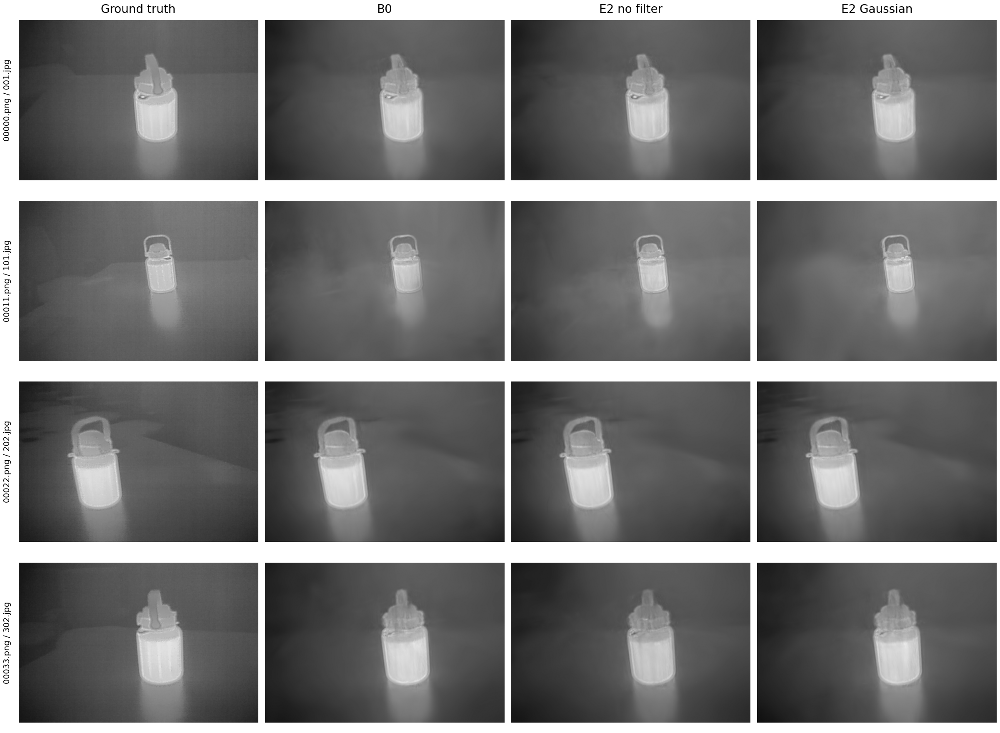
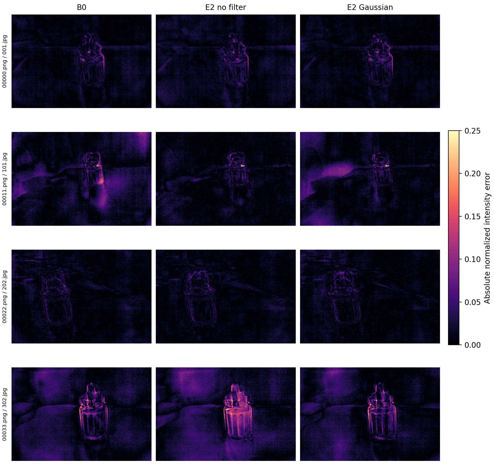
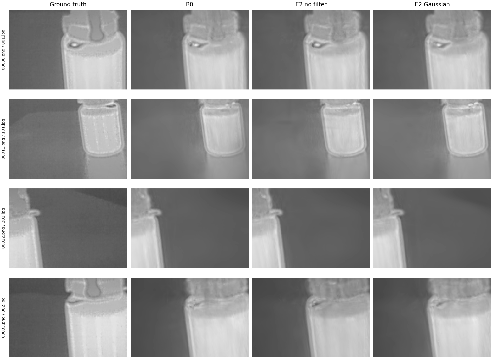
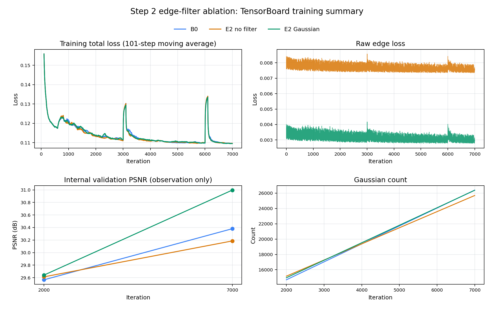

# Thermal3D-GS Step 2：边缘滤波消融与 7k 验证报告

日期：2026-09-09
状态：已完成 7k 筛选；未运行 30k；未访问 test 集。

## 1. 研究问题

本轮只检验 filtered-edge 中的 Gaussian 预滤波是否有效，不引入新模块，也不重新调权重。

| 方法 | 辅助损失 | 边缘滤波 | `lambda_edge` |
|---|---|---|---:|
| B0 | legacy baseline | 不生效 | 0 |
| E2_no_filter | filtered-edge | identity | 0.001 |
| E2 | filtered-edge | Gaussian，kernel=5，sigma=1.0 | 0.001 |

三组均使用 TI-NSD heated、Sparse-25、noise03、split seed 2026、train seed 2026、resolution 1、CPU 图像驻留与 on-demand GPU 传输。代码冻结提交为 `86b9b78b6b464795a41c3baa98c4219bb359c12f`，三组 source snapshot 均为 `4b5de169c39ad88e37c81ff301f784a945a4e7bbb40293ebeb04e2a28c3f3cc3`。

输入文件 SHA256：

- dataset manifest：`d4fe9c97ed110fa1ecdf0636a19f7a7062169d3cfbd719d5594158f9d615e919`
- split manifest：`c9a1e0aa65e54e1558779b557539cb2eaba4d1faab765b786a4437aa519ba79e`
- degradation manifest：`06d68ec82b7faa8d65168b9bd2b35f013207331f4683a2ec0ad883837be3f03b`

## 2. 验证指标

以下结果来自独立 `render.py` 生成的 val PNG，而不是训练内部观察值。每组、每个检查点均为 34 对同名 render/GT。PSNR、SSIM 和 Gradient preservation 越高越好；T-MAE、E-MAE 越低越好。

### 2k

| 方法 | PSNR | SSIM | T-MAE | E-MAE | Gradient preservation |
|---|---:|---:|---:|---:|---:|
| B0 | 29.565263 | 0.943035 | 0.028257 | 0.006727 | 0.537571 |
| E2_no_filter | 29.610607 | 0.943170 | 0.027793 | **0.006696** | 0.539551 |
| E2 | **29.641565** | **0.944697** | **0.026947** | 0.006759 | **0.541799** |

2k 时，E2 相对 E2_no_filter 在 PSNR、SSIM、T-MAE 和 Gradient preservation 上改善，但 E-MAE 退化 `+0.00006327`。E2 相对 B0 也是四项改善、一项 E-MAE 退化。

### 7k

| 方法 | PSNR | SSIM | T-MAE | E-MAE | Gradient preservation |
|---|---:|---:|---:|---:|---:|
| B0 | 30.390517 | 0.943418 | 0.027913 | **0.006423** | **0.537452** |
| E2_no_filter | 30.192959 | 0.945010 | 0.027730 | 0.006469 | 0.523843 |
| E2 | **31.004501** | **0.947949** | **0.023965** | 0.006425 | 0.527460 |

7k 的关键配对差值（左侧减右侧）：

| 比较 | Delta PSNR | Delta SSIM | Delta T-MAE | Delta E-MAE | Delta Gradient preservation |
|---|---:|---:|---:|---:|---:|
| E2 - E2_no_filter | +0.811542 | +0.002939 | -0.003765 | -0.000044 | +0.003617 |
| E2 - B0 | +0.613984 | +0.004531 | -0.003949 | +0.000002 | -0.009992 |
| E2_no_filter - B0 | -0.197558 | +0.001592 | -0.000183 | +0.000046 | -0.013609 |

结论：在同一 filtered-edge 公式内，Gaussian 预滤波相对 identity 在 7k 的五项均值指标全部改善，因此本轮证据支持保留 Gaussian 预滤波。相对 B0，E2 明显改善 PSNR、SSIM 和 T-MAE，但 E-MAE 极小幅退化，Gradient preservation 也退化；因此不能表述为“所有边缘指标均优于基线”。E2_no_filter 相对 B0 的结果混合，说明边缘损失本身并不自动带来稳定收益。

逐视角结果也不是单向胜出。例如 7k 的 E2 - E2_no_filter 在五项指标上的改善/退化视角数依次为 `19/15`、`16/18`、`21/13`、`16/18`、`21/13`。均值改善与胜出视角数可能方向不同，完整记录见 `per_view_deltas.csv`。

## 3. 资源开销

| 方法 | 训练墙钟 | 相对 B0 | 7k core avg | CUDA allocated peak | 7k forward |
|---|---:|---:|---:|---:|---:|
| B0 | 465.933 s | - | 51.422 ms | 596.748 MB | 22.431 ms |
| E2_no_filter | 481.149 s | +3.27% | 53.690 ms | 598.329 MB | 21.335 ms |
| E2 | 493.188 s | +5.85% | 55.365 ms | 596.826 MB | 21.800 ms |

三组纯训练合计约 24.004 分钟。`core avg` 是 CUDA event 记录的训练核心区间，不能替代完整迭代墙钟；显存列是 PyTorch allocated peak，不是整卡占用。

## 4. 固定定性结果

视角在查看结果前固定为 `00000/00011/00022/00033`，分别对应原始 val `001/101/202/302.jpg`。中心 crop 固定为 `[238,159,477,320]`，误差图统一使用 `magma` 和 `[0,0.25]`，没有逐图归一化。

## 5. 可追溯性与限制

训练曲线静态归档如下；其中训练内部 val PSNR 仅用于观察，主结论仍以独立 PNG 指标为准。

- 三组 `run_manifest.json` 均为 `completed`，Git 状态为空，stderr 为 0 字节。
- 每组 CSV 精确记录 `500..7000` 共 14 行；所有损失有限且加权算术通过。
- 每组 2k/7k 的 point cloud、ATF、TCM 快照完整；2k/7k val 各 34 对 PNG，尺寸均为 `715x479`。
- 评估环境为 Python 3.11.9、PyTorch 2.5.1+cu121、CUDA device；SSIM 实际后端为冻结的 `metrics.py` fallback 实现。
- LPIPS 和 ROI-MAE 按协议标记为 `unavailable`，没有用替代值填充。
- `metrics_manifest.json` 绑定所有 render/GT、指标表、指标实现和运行时哈希；`results_manifest.json` 再绑定分析输入和六个派生产物。
- 本轮只有一个场景、一个数据 split 和一个训练 seed，属于 7k 筛选证据，不能替代多 seed 30k 正式结论。
- 历史 Priority-1 结果使用不同代码快照，本报告不把它们作为直接配对对照。

## 6. 产物索引

- `val_2000/metrics_summary.md`：2k 汇总指标
- `val_7000/metrics_summary.md`：7k 汇总指标
- `metrics_deltas.csv`：30 行检查点/比较/指标差值
- `per_view_deltas.csv`：1020 行逐视角差值
- `resource_summary.csv`：6 行资源统计
- `results_manifest.json`：结果 provenance 与 SHA256
- `tensorboard_training_summary.png`：三组 TensorBoard 静态曲线
- `tensorboard_summary_manifest.json`：事件文件与静态图 SHA256

TensorBoard 事件文件保存在三个 run 根目录，可通过 `http://127.0.0.1:6007/` 回放。详细复现实验命令与停止条件见 `docs/edge_filter_ablation_protocol.md`。下一阶段如需运行 30k，必须先获得新的明确确认。
